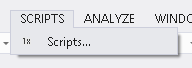
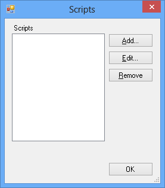
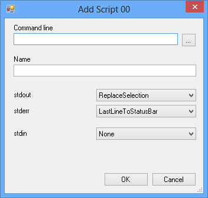
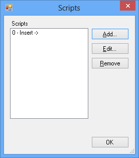
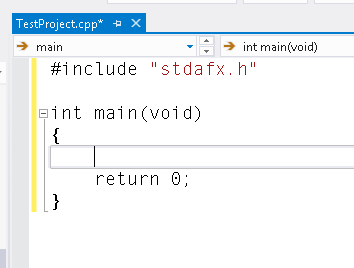
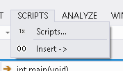
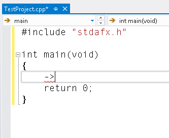
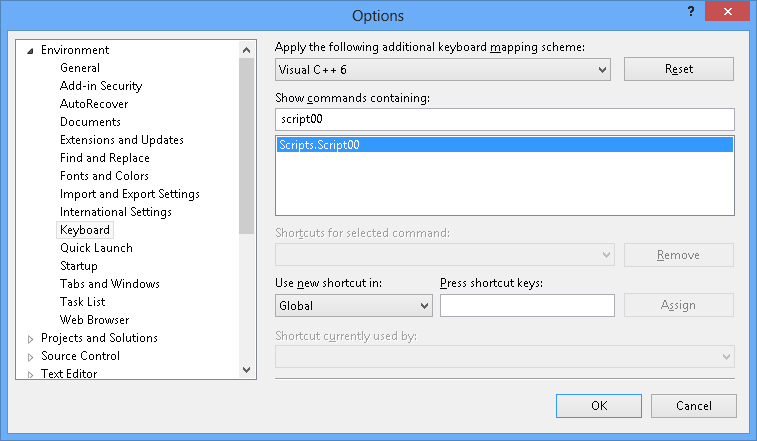
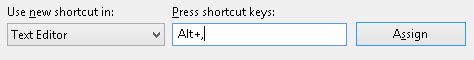

VSScripts
=========

The VSScripts extension package adds a simple macro facility to Visual
Studio for inserting and transforming text. It runs a command line
program from within the IDE, feeding it the selection via stdin, and
captures the output. Then it replaces the selection with the output.

You can write your macros in any language you like, pretty
much. Often, you won't need anything fancier than a simple batch file.

(If you've ever used the User Scripts facility of Xcode 3.x, or emacs's
`shell-command-on-region`, this should be familiar.)

installation
============

installing pre-built version (Visual Studio 2012)
-------------------------------------------------

Run `installers\VSScripts-0.2.4911.2480.vsix`.

(This edition is provided as-is - sorry! I don't use Visual Studio
2012 any more but this was the version I used. The Visual Studio 2013+
version may work too.)

installing pre-built version (Visual Studio 2013+)
--------------------------------------------------

Look in `installers` folder for .vsix file with largest numbers
attached. Run that file.

This version advertises compatibility with VS2012 and later. I've
tested it with VS2013 and VS2015.

building it yourself
--------------------

Build with Visual Studio 2013.

You'll need the Visual Studio 2013 SDK, which you can get from here:

https://www.microsoft.com/en-us/download/confirmation.aspx?id=40758

Once you have that installed, load SLN into Visual Studio 2013. Set up
debugging options as follows, adjusting the path to `devenv.exe` as
appropriate:

<dl>
<dt><code>Start external program</code></dt>
<dd><code>C:\Program Files (x86)\Microsoft Visual Studio 12.0\Common7\IDE\devenv.exe</code></dd>
<dt><code>Command line arguments</code></dt>
<dd><code>/rootsuffix Exp</code></dd>
</dl>

Then build, and run - it will run the experimental version of Visual
Studio.

Once you're happy, find the VSIX file in the `bin\Debug` or
`bin\Release` folder and double-click to install.

quick walkthrough
=================

(The screen grabs for this walkthrough were taken in VS2013, but it's
very similar for VS2015.)

Once you have the VSScripts extension installed, run Visual Studio.

Note new SCRIPTS menu.

It might not look like much.

Click `Scripts...` to reveal the Scripts dialog.

Click `Add...` to add a new script.

You get to specify details straight away - let's use one of the
examples supplied by setting things up as follows:

<dl>
<dt><code>Command Line</code></dt>
<dd>use the <code>...</code> button to find the <code>examples\InsertArrow.bat</code> file from the distribution.</dd>
<dt><code>Name</code></dt>
<dd><code>Insert -></code></dd>
<dt><code>stdout</code></dt>
<dd>leave this at the default of <code>ReplaceSelection</code>.</dd>
<dt><code>stderr</code></dt>
<dd>leave this at the default of <code>LastLineToStatusBar</code>.</dd>
<dt><code>stdin</code></dt>
<dd>leave this at the default of <code>None</code>.</dd>
</dl>

You're done! Click `OK`. Your script was added.

Click `OK` to get back to the text editor, and put the caret somewhere you can see it.

Visit the scripts menu - note your script is there!

Select it!

Result! (Even if the compiler doesn't agree.)

Nearly done. Let's assign a keyboard shortcut.

Look in the `SCRIPTS` menu - note the `00` icon. You can also see a
`0` next to the script's name, if you visit the scripts dialog. And it
also said `Script 00` when adding it. This is trying to tell you
something: that this is script 00.

(Don't forget this, because the options dialog is modal.)

Go to the options dialog, keyboard section, and enter `script00` in
the `Show commands containing:` box. There'll probably be one command
matching it: `Scripts.Script00`.

`Scripts.Script00` is the one that runs Script 00 (hopefully this is
not confusing).

Assign it a keyboard shortcut. You're also best off setting it to be
usable in the text editor only, but it's up to you.

script settings summary
=======================

Command line
------------

This can be anything that you can type at the command prompt, pretty
much. The command line is executed via `CMD /C`, so you can use
builtin commands (`SET`, `VER`, `ECHO`, etc.), or invoke batch files,
or run scripts with file type assocations (e.g., python scripts), and
so on.

`stdout` and `stderr` settings
------------------------------

<dl>
<dt>Discard</dt>
<dd>the output is discarded.</dd>
<dt>ReplaceSelection</dt>
<dd>the output replaces the current selection. (The last newline is discarded, if there is one, so if you really want the result to end with a newline then you must print an extra one. This is a .NET limitation.)</dd>
<dt>FirstLineToStatusBar</dt>
<dd>the first non-empty line of the output is displayed on the status bar.</dd>
<dt>LastLineToStatusBar</dt>
<dd>the last non-empty line of the output is displayed on the status bar.</dd>
<dt>ReplaceOutputWindow</dt>
<dd>the output is sent to an output window pane called <code>VSScripts</code>, replacing the previous contents.</dd>
<dt>AppendToOutputWindow</dt>
<dd>the output is appended to an output window pane called <code>VSScripts</code>.</dd>
</dl>

`stdin` settings
----------------

<dl>
<dt>None</dt>
<dd>no input is supplied.</dd>
<dt>CurrentLine</dt>
<dd>the contents of the current line, excluding line ending, is sent.</dd>
<dt>Selection</dt>
<dd>the contents of the selection is sent.</dd>
</dl>

making your own scripts
-----------------------

You can write scripts in any language. Just set up the stdin, stdout
and stderr options as appropriate for its behaviour.

(If you're running a file that relies on a custom file type to do its
thing, you may get the Windows "Choose which program you want to run
this file" dialog - which you should deal with as you see fit. I don't
know what rules govern this dialog's appearance, but I've had it when
trying to run Python files. And I clicked the "Always use this
program" box so I'd never have to see it again.)

There are a few pieces of information supplied via environment
variables:

<dl>
<dt>FullPath</dt>
<dd>full path of file being edited.</dd>
<dt>Filename</dt>
<dd>name of file being edited, no path or extension.</dd>
<dt>Extension</dt>
<dd>extension of name of file being edited, with a leading <code>.</code>.</dd>
<dt>Directory</dt>
<dd>directory of file being edited, excluding drive letter.</dd>
<dt>RootDir</dt>
<dd>drive letter of file being edited, with trailing separator.</dd>
<dt>TabSize</dt>
<dd>width of a tab, in spaces.</dd>
</dl>

bugs/problems
=============

- Box selection behaviour is far from perfect. It works well enough
  for my purposes though and I'm sick of poking at it for now.

- Should be cleverer about box selections. With box selection active,
  if output includes a newline, should replace box with new output. If
  output doesn't include a newline, and box selection is 0 chars wide,
  should treat box selection as multiple cursors. That should probably
  cater for most cases. At the moment it's easy to end up with a big
  mess.

- Needs more stdin/stdout/stderr options.

- Would be nice to be able to rearrange the scripts order.

- Would be nice to be able to name the commands dynamically rather
  than have the stupid numbers - not sure Visual Studio will do this.

- Should be able to supply dynamic information to scripts via command
  line.

- Should be able to handle I/O via temp files, if the script would
  need that.

(etc., etc.)
